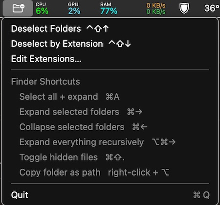
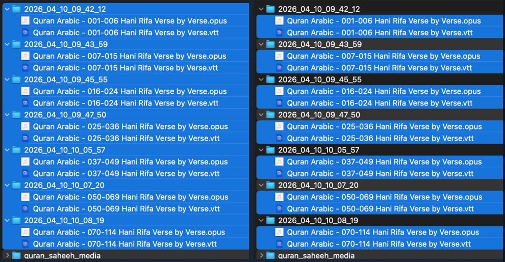

# deselectfolders

A macOS menu bar utility for Finder power users. Select a mix of files and
folders in List View, then use a global hotkey to deselect just the folders
(or just files with specific extensions) — useful when you want to
copy/move only files without manually Cmd-clicking every folder out of
your selection.

## Shortcuts

- `⌃⇧↑` — Deselect folders from current selection
- `⌃⇧↓` — Deselect files matching configured extensions (default: jpg, pdf)

Edit the extension list from the menu bar icon → "Edit Extensions…"

## Requirements

- macOS 11+
- Accessibility permission (prompted on first use)
- [librsvg](https://formulae.brew.sh/formula/librsvg) for building the app icon: `brew install librsvg`

## Build & Install

\`\`\`bash
chmod +x build.sh
./build.sh
cp -R deselectfolders.app /Applications/
xattr -d com.apple.quarantine /Applications/deselectfolders.app
open /Applications/deselectfolders.app
\`\`\`

Grant Accessibility access when prompted
(System Settings → Privacy & Security → Accessibility).

## How it works

Uses the macOS Accessibility API (`AXUIElement`) to inspect Finder's
List View outline, check which rows are selected, and identify folders
(via disclosure triangle) or file extensions (via filename), then
deselects matching rows. Hotkeys are registered globally via Carbon's
`RegisterEventHotKey`.
